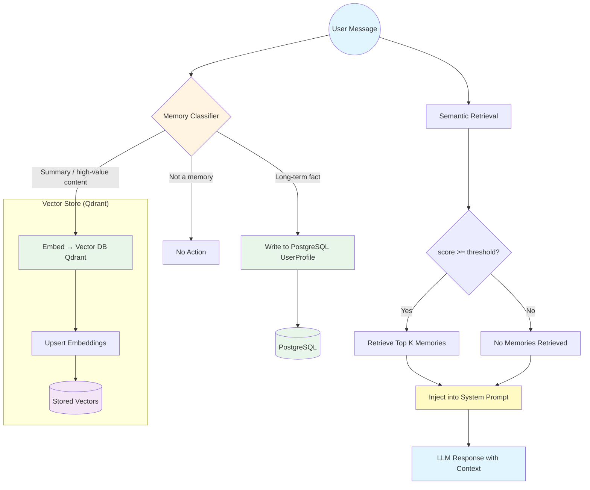

# Memory Flow Diagram

This diagram illustrates the long-term memory flow from user message to LLM response.

## Components

- **Memory Classifier**: LLM-based classification to detect memory-worthy content
- **PostgreSQL UserProfile**: Stores stable facts (VIN, preferences, etc.)
- **Qdrant Vector Store**: Stores embeddings for semantic search
- **Semantic Retrieval**: Top-K search with similarity threshold filtering
- **System Prompt Injection**: Relevant memories added to LLM context

## Decision Points

1. **Classification**: Determines if message contains long-term memory
2. **Threshold Check**: Only memories above `MEM_MIN_SCORE` are injected
3. **Storage Path**: Different storage for facts vs. summaries
